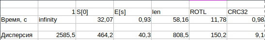
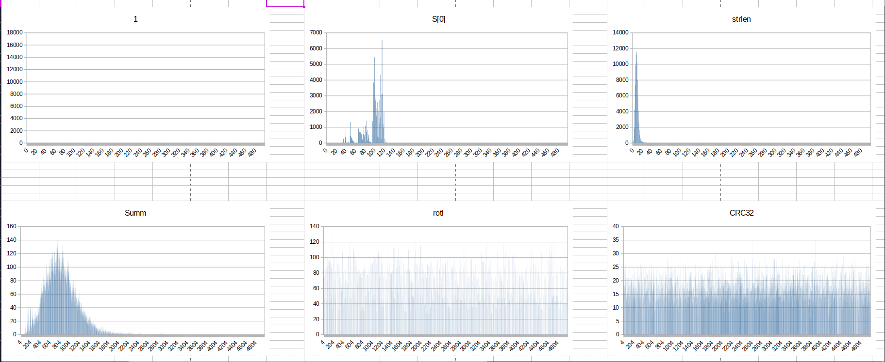

# Использование низкоуровневого машинного кода для оптимизации хеш-таблицы

## Постановка задачи:
Имеется большой набор слов. Требуется уметь загрузить все слова в структуру данных, а потом быстро и много отвечать на запросы, сколько раз встречалось слово в исходном тексте. Также желательно иметь итераторный доступ ко всем словам (необязательно упорядоченный).
Длина слова до 32.

### Решение
Принято решение использовать хеш-таблицу со вторичной структурой данных (СД), ввиду хороший временных показателей.
Принято решение использовать общий односвязный список с фиктивными элементами в качестве разделителей.

## Начало
Был написан первый вариант хеш-таблицы и сгенерирован набор тестов.
В качестве хеш-функции для начала выбрали rotHash (нет).
Итоговые результаты удручают:
общее время - 4 минуты 5 секунд.

### Хеш-тест
Возникло предположение, что использованная хеш-функция плохая как по времени, так и по распределению данных по таблице.
Для сравнения с другими хеш-функциями были отобраны 6 функций и с ними проведен спектральный тест. (Для этого размер таблицы уменьшен в 10 раз).
1. return const 1
2. s[0]
3. sum(s[i])
4. strlen(s)
5. rotl hash
6. встроенный crc32

Действительно, rot_hash кластеризован и долгий.
Был выбран, пусть и не самый быстрый, но самый спокойный crc32.

Для реализации crc32 были выбран intrinsics. Как дающие самый лаконичный код, без потери производительности.

Итого 29 с
### Ещё больше оптимизаций.

Далее в попытках узнать, можно ли еще с оптимизировать была собрана статистика.
Оказалось, что почти 30% времени занимает strncmp.
> Значит он такой хороший, ничего не трогаем.

Нет. А то засмеют. Хаха. Очень смешно.

Заметим, что слова до 32 идеально лезут в 256-регистр.
Используем это и пишем cmp... И удивляемся.  15 с.

Также было обнаружено, что автор идиот...

### Ещё
Также были предприняты другие попытки оптимизации, но они или давали прирост менее чем на 1% или вообще ухудшали. Более того, согласно профилированию, самой нагруженной частью является if отвечающий за сравнение.

Итоговый КПД (Коэффициент производительности Дединского):

КПД = (16 / 4) * 1000 = 4000.